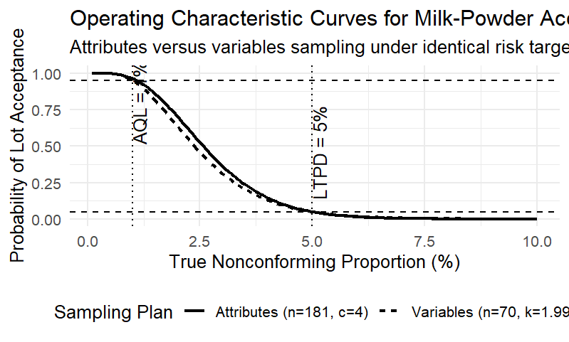
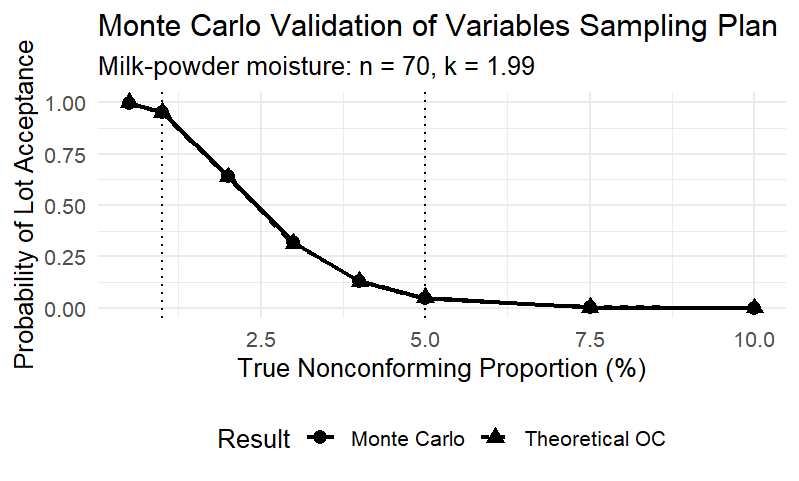
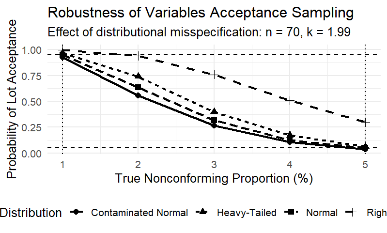

# Risk-Constrained Acceptance Sampling for Food Import Quality Assurance

## A Milk-Powder Case Study in Statistical Quality Control

This project develops and evaluates statistical acceptance-sampling strategies for quality assurance of imported food consignments, using **milk-powder moisture content** as a case study motivated by the regulatory context of the **Food Safety and Standards Authority of India (FSSAI)**.

### Research Question

> **Can variables acceptance sampling reduce the number of units requiring inspection while maintaining predefined producer- and consumer-risk constraints?**

The project compares **attributes sampling** with **variables sampling**, optimizes the required sample sizes, constructs Operating Characteristic (OC) curves, validates the theoretical results using Monte Carlo simulation, and investigates robustness to violations of the normality assumption.

---

# 1. Regulatory Context

Milk powder is used as the illustrative high-risk food commodity.

The quality characteristic considered in this project is **moisture content**.

The upper specification limit is:

$$
U = 5.0\%
$$

For the purposes of this statistical study, a sampled unit is classified as nonconforming when:

$$
X > 5.0\%
$$

where $X$ represents the measured moisture content.

The FSSAI specification provides the regulatory context for the case study.

**Important:** The AQL, LTPD, producer-risk, and consumer-risk values used below are statistical design assumptions for this project. They should not be interpreted as FSSAI-prescribed acceptance-sampling parameters.

---

# 2. Statistical Design

The following acceptance-sampling scenario is considered:

| Parameter | Value |
|---|---:|
| Acceptable Quality Level (AQL) | 1% nonconforming |
| Lot Tolerance Percent Defective (LTPD) | 5% nonconforming |
| Producer's risk ($\alpha$) | 5% |
| Consumer's risk ($\beta$) | 5% |
| Moisture upper specification limit | 5.0% |

Let $P_A(p)$ denote the probability that a shipment is accepted when its true nonconforming proportion is $p$.

The sampling plans are required to satisfy:

$$
P_A(0.01) \geq 0.95
$$

and

$$
P_A(0.05) \leq 0.05
$$

Therefore, a lot at the AQL should have at least a **95% probability of acceptance**, while a lot at the LTPD should have at most a **5% probability of acceptance**.

The optimization objective is to find the **minimum sample size** satisfying both requirements.

---

# 3. Attributes Acceptance Sampling

In attributes sampling, each sampled unit is classified as either:

- conforming, or
- nonconforming.

Let $D$ denote the number of nonconforming units found in a sample of size $n$.

Under a binomial model:

$$
D \sim \text{Binomial}(n,p)
$$

For a single-sampling plan $(n,c)$, the lot is accepted when:

$$
D \leq c
$$

where $c$ is the acceptance number.

The probability of acceptance is therefore:

$$
P_A(p) = P(D \leq c)
$$


A numerical search over feasible values of $n$ and $c$ was performed subject to the producer- and consumer-risk constraints.

## Optimized Attributes Plan

The minimum feasible plan obtained was:

**Sample size: 181**

**Acceptance number: 4**

Therefore:

> Randomly inspect **181 units** and accept the shipment if no more than **4 units are nonconforming**.

The shipment is rejected if **5 or more nonconforming units** are observed.

---

# 4. Variables Acceptance Sampling

Attributes sampling converts every moisture measurement into only a pass/fail classification.

For example:

- 4.99% moisture → conforming
- 5.01% moisture → nonconforming

This discards information contained in the actual continuous measurements.

Variables sampling instead retains the measured moisture values.

For an upper specification limit $U = 5\%$, define the quality statistic:

$$
Q_U = \frac{U-\bar{X}}{S}
$$

where:

- $\bar{X}$ = sample mean moisture content
- $S$ = sample standard deviation
- $U$ = upper specification limit

The lot is accepted when:

$$
Q_U \geq k
$$

where $k$ is the acceptance constant.

---

# 5. Variables Plan with Known Process Variability

As an initial theoretical benchmark, the population standard deviation $\sigma$ was assumed to be known.

Under this assumption, optimization produced:

| Parameter | Result |
|---|---:|
| Sample size | 24 |
| Acceptance constant | 1.9809 |

Thus, only **24 observations** were required under the known-$\sigma$ assumption.

However, this assumption is generally unrealistic in practical inspection because the true process variability will usually not be known exactly.

For this reason, the known-$\sigma$ result is treated only as a theoretical benchmark.

---

# 6. Variables Plan with Unknown Process Variability

A more realistic procedure estimates process variability using the sample standard deviation $S$.

The acceptance statistic becomes:

$$
Q_U = \frac{5-\bar{X}}{S}
$$

Because $S$ is random, acceptance probabilities were calculated using the **noncentral t distribution**.

Numerical optimization produced:

| Parameter | Result |
|---|---:|
| Minimum sample size | 70 |
| Acceptance constant | 1.99 |

The practical decision rule is therefore:

> Take **70 milk-powder samples**, calculate their mean moisture content and standard deviation, and accept the lot when:

$$
\frac{5-\bar{X}}{S} \geq 1.99
$$

Otherwise, reject the lot under the proposed statistical rule.

---

# 7. Comparison of Sampling Plans

| Sampling Method | Sample Size | Decision Rule |
|---|---:|---|
| Attributes | 181 | Accept if defectives ≤ 4 |
| Variables — known $\sigma$ | 24 | Accept if $Q \geq 1.981$ |
| Variables — unknown $\sigma$ | 70 | Accept if $Q \geq 1.99$ |

The practically relevant comparison is between:

**Attributes sampling: 181 observations**

and

**Variables sampling with unknown variance: 70 observations**

The percentage reduction in sample size is:

$$
\frac{181-70}{181}\times100 = 61.33\%
$$

### Key Result

**Variables sampling reduced the optimized sample requirement from 181 units to 70 units — a 61.33% reduction — under the assumed normal model and specified risk-design parameters.**

---

# 8. Operating Characteristic Curves

The Operating Characteristic (OC) curve describes the probability of accepting a shipment as its true nonconforming proportion changes.

Both sampling plans were designed around the same endpoint requirements:

$$
P_A(0.01) \geq 0.95
$$

and

$$
P_A(0.05) \leq 0.05
$$

The attributes and variables plans therefore target comparable producer and consumer protection at the specified design points despite using substantially different sample sizes.

## OC Curve Comparison



The comparison demonstrates that the variables plan can achieve similar endpoint risk protection while requiring substantially fewer observations under the assumed statistical model.

---

# 9. Monte Carlo Validation

The theoretical variables-sampling OC curve was independently validated using Monte Carlo simulation.

The following true nonconforming proportions were investigated:

**0.5%, 1%, 2%, 3%, 4%, 5%, 7.5%, and 10%.**

For each quality level, **10,000 simulated samples** were generated.

Each simulation used the variables plan:

- $n = 70$
- $k = 1.99$
- $U = 5\%$

For every simulated sample:

1. Generate 70 moisture measurements.
2. Calculate $\bar{X}$.
3. Calculate $S$.
4. Calculate:

$$
Q = \frac{5-\bar{X}}{S}
$$

5. Accept the simulated shipment if:

$$
Q \geq 1.99
$$

The empirical acceptance probabilities were then compared with the theoretical probabilities obtained from the noncentral t distribution.

## Monte Carlo Result



The mean absolute difference between the simulated and theoretical acceptance probabilities was:

**0.00226**

or approximately **0.23 percentage points**.

The close agreement provides computational validation of the theoretical OC calculations **under the assumed normal moisture model**.

---

# 10. Robustness to Distributional Misspecification

The efficiency of variables sampling depends on assumptions about the underlying distribution of the continuous quality characteristic.

To investigate this limitation, the $n=70$, $k=1.99$ plan was tested under four simulated distributions:

1. Normal
2. Shifted lognormal
3. Heavy-tailed Student-t
4. Contaminated normal

Each distribution was calibrated to produce the specified true proportion of observations above the 5% moisture limit.

## Robustness Results



The resulting risks at the two design points were:

| Distribution | Producer Risk at AQL = 1% | Consumer Risk at LTPD = 5% |
|---|---:|---:|
| Normal | 5.18% | 5.01% |
| Shifted lognormal | 0.24% | 30.00% |
| Heavy-tailed | 3.08% | 6.36% |
| Contaminated normal | 7.51% | 3.81% |

---

# 11. Important Robustness Finding

Under normality, the sampling plan approximately reproduces the intended 5% producer- and consumer-risk targets.

However, these guarantees are **not distribution-free**.

The strongest departure occurred under the shifted-lognormal scenario.

At the LTPD of 5%, consumer risk increased from approximately:

**5% under normality**

to

**30% under the shifted-lognormal simulation.**

This means that a shipment with a true 5% nonconforming rate was accepted approximately 30% of the time under this particular misspecified distribution.

The heavy-tailed distribution produced a smaller increase in consumer risk to **6.36%**.

The contaminated-normal distribution instead became more conservative from the consumer perspective, with consumer risk decreasing to **3.81%**, while producer risk increased to **7.51%**.

---

# 12. Main Statistical Finding

The project identifies an important **efficiency–robustness trade-off**.

Under the assumed normal moisture model, variables acceptance sampling reduced the optimized sample requirement from:

**181 units to 70 units**

representing a:

**61.33% reduction in required sample size.**

Monte Carlo simulation strongly reproduced the theoretical operating characteristics, with a mean absolute error of only **0.00226**.

However, robustness analysis demonstrated that the efficiency advantage is conditional on the distributional model.

Strong distributional misspecification can materially alter producer and consumer risks.

Therefore:

> **Variables sampling can substantially reduce inspection burden by exploiting continuous quality measurements, but its nominal risk guarantees depend on the adequacy of the underlying distributional assumptions.**

---

# 13. Proposed Risk-Adaptive Inspection Framework

The results motivate a potential hybrid statistical framework.

### Stage 1 — Obtain Continuous Measurements

Collect quantitative moisture measurements from sampled milk-powder units.

### Stage 2 — Assess Model Adequacy

Evaluate whether the observed measurements are reasonably compatible with the assumptions required for variables acceptance sampling.

### Stage 3 — Select Inspection Strategy

If the variables-model assumptions are considered adequate, apply the more sample-efficient variables procedure.

If the assumptions are questionable, use a more assumption-robust inspection strategy rather than relying on nominal variables-plan risk guarantees.

This motivates future research into **risk-adaptive acceptance sampling** for food quality assurance.

---

# 14. Repository Structure

```text
fssai-acceptance-sampling/
│
├── README.md
├── LICENSE
│
├── R/
│   ├── 01_attributes_plan.R
│   ├── 02_variables_known_sigma.R
│   ├── 03_variables_unknown_sigma.R
│   ├── 04_oc_curve_comparison.R
│   ├── 05_monte_carlo_validation.R
│   └── 06_robustness_analysis.R
│
├── figures/
│   ├── oc_curve_comparison.png
│   ├── monte_carlo_validation.png
│   └── robustness_analysis.png
│
└── results/
    ├── sampling_plan_comparison.csv
    └── robustness_results.csv
```

---

# 15. Reproducibility

The analysis was conducted in **R**.

The main functions used include:

| Function | Purpose |
|---|---|
| `pbinom()` | Binomial acceptance probabilities |
| `pnorm()` | Normal probabilities |
| `qnorm()` | Normal quantiles |
| `pt()` | Noncentral-t acceptance probabilities |
| `rnorm()` | Normal simulation |
| `rlnorm()` | Shifted-lognormal simulation |
| `rt()` | Heavy-tailed simulation |
| `uniroot()` | Numerical calibration |
| `ggplot2` | Statistical visualization |

A fixed random seed is used in the simulation scripts to make the Monte Carlo analyses reproducible.

---

# 16. Limitations

This project is a **statistical case study**, not an official FSSAI sampling protocol.

Important limitations include:

- AQL = 1%, LTPD = 5%, producer's risk = 5%, and consumer's risk = 5% are study design assumptions rather than claimed FSSAI-prescribed values.
- The variables sampling procedure relies on distributional assumptions.
- The robustness analysis considers selected alternative distributions and is not exhaustive.
- Simulated results do not substitute for validation using real consignment-level milk-powder data.
- Laboratory measurement error has not yet been explicitly modeled.
- Operational inspection costs have not yet been incorporated.
- Lot formation and finite-population considerations may affect practical implementation.
- Regulatory implementation would require validation beyond the statistical analysis presented here.

---

# 17. Future Extensions

Possible extensions include:

- Cost-sensitive sampling optimization
- Finite-lot corrections
- Measurement-error modeling
- Alternative AQL/LTPD scenarios
- Robust acceptance-sampling procedures
- Distribution-free methods
- Sequential sampling
- Double-sampling plans
- Bayesian acceptance sampling
- Real milk-powder quality data
- Risk-based inspection according to shipment characteristics
- Optimization incorporating laboratory testing costs

---

# Disclaimer

This repository is an **independent statistical research project developed for educational and analytical purposes**.

It does not represent an official FSSAI sampling procedure, regulatory recommendation, endorsement, or operational decision rule
